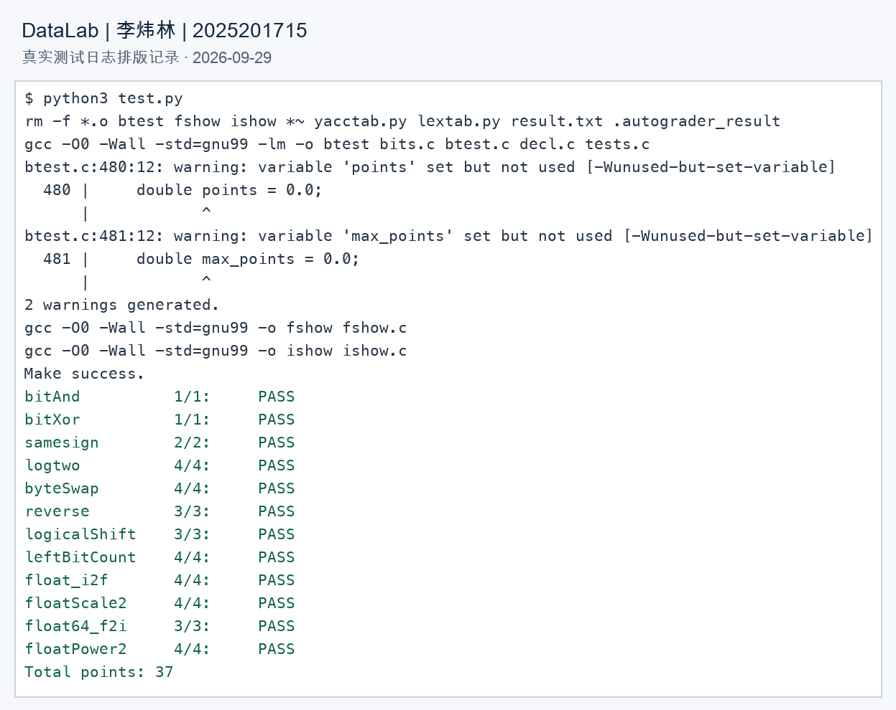

# DataLab 实验报告

姓名：李炜林

学号：2025201715

验证日期：2026-09-29

## 1. 实验结果

执行 `python3 test.py -V`，12 个函数的正确性与操作符检查均通过，总分 **37/37**。操作次数由项目评分脚本统计。

| 函数 | 得分 | 操作次数 / 上限 |
| --- | --- | --- |
| bitAnd | 1/1 | 4/7 |
| bitXor | 1/1 | 7/7 |
| samesign | 2/2 | 7/12 |
| logtwo | 4/4 | 18/25 |
| byteSwap | 4/4 | 13/17 |
| reverse | 3/3 | 23/30 |
| logicalShift | 3/3 | 13/20 |
| leftBitCount | 4/4 | 33/50 |
| float_i2f | 4/4 | 27/30 |
| floatScale2 | 4/4 | 13/30 |
| float64_f2i | 3/3 | 18/60 |
| floatPower2 | 4/4 | 9/30 |
| 合计 | 37/37 | 各题均未超过上限 |

### 验证说明

- 使用项目原有 `test.py` 检查正确性、允许的操作符、变量类型和操作次数，未修改评分脚本或测试程序。
- 对 `bits.c` 单独执行 Clang 的 `-Wall -Wextra -Werror -std=gnu99` 检查，无编译警告。
- 额外在 `-O2` 和 UndefinedBehaviorSanitizer 下完成 200000 组确定性输入验证；每组覆盖 16 种字节交换位置及 32 种右移位数，并与独立参考计算对比。加入 INT_MIN、INT_MAX、-1、0、1 及浮点指数边界；该轮检查未报告未定义行为。
- 原有 `btest.c` 在本机 Clang 下产生两条“变量赋值后未使用”的警告，位置为第 480、481 行。它们属于测试框架，依照不修改测试文件的要求予以保留。
- 实现沿用题设的 32 位补码整数与算术右移环境。额外测试是对评分脚本的补充，不等同于对所有输入的形式化证明。

<!-- pagebreak -->

## 2. 测试输出

下图由本次 `python3 test.py` 的真实运行日志排版生成，保留了测试框架的编译警告和全部评分结果；它是输出记录图，不是终端原生截图。原始文本保存在 [test-output.txt](imgs/test-output.txt)。



复现命令：

```bash
python3 test.py
python3 test.py -V
```

<!-- pagebreak -->

## 3. 解题思路：整数位运算

### 亮点

`reverse` 通过固定层数的分组交换反转所有位；`leftBitCount` 用二分定位减少逐位检查；`float_i2f` 显式处理舍入到偶数和尾数进位。

### bitAnd

使用德摩根律：`x & y = ~(~x | ~y)`。先对两个数分别取反，再取或，最后整体取反，保留且仅保留两数都为 1 的位。只使用 `~`、`|`，共 4 次操作。

### bitXor

异或要求两个对应位不同。`~(x & y)` 排除“同时为 1”，`~(~x & ~y)` 排除“同时为 0”，两者相与即得到异或。四种单比特输入均符合真值表，共 7 次操作。

### samesign

0 既不是正数也不是负数，因此先分别处理 x、y 为 0 的情况：只有两数都为 0 才返回 1。其余输入通过算术右移 31 位提取符号，异或后取逻辑非判断符号是否相同。避免把 0 和正数归为同一类。

### logtwo

按 16、8、4、2、1 位逐级缩小最高有效位的位置。若当前值大于对应低位全 1 的掩码，就右移该位数，并把位数合并到结果中。各级位数对应结果的不同二进制位，可用按位或累计。结果是向下取整的 log2，例如 32 和 63 都返回 5；输入 1 返回 0。

### byteSwap

将字节编号乘以 8 得到位偏移，右移并用 0xFF 提取两个字节。两个字节的异或值 diff 表示它们不同的位；把 diff 放回两个位置并与原数异或，便可同时完成交换，其余位置不变。n=m 时 diff 为 0，结果自然等于原数。

左移前使用 `diff & 0xFFu`，让表达式按无符号规则移位，避免将最高字节移入符号位时发生有符号溢出。局部变量均为 int，未使用显式强制转换；此处无符号常量会触发表达式的隐式转换，返回 int 时沿用题设的 32 位补码环境。该类型处理是为保留按字节交换算法并避免左移溢出，评分脚本检查通过。

### reverse

依次交换相邻的 1 位、2 位、4 位、8 位分组，最后交换高低 16 位。每级用掩码隔离两组，再反向移位并合并。掩码分别为 0x55555555、0x33333333、0x0F0F0F0F、0x00FF00FF。全过程使用函数允许的 unsigned 运算，共 23 次操作。

<!-- pagebreak -->

## 4. 解题思路：移位与浮点数

### logicalShift

算术右移后，用低位全 1 的掩码清除符号扩展。令 zero 为 `!n`，掩码为 `0x7FFFFFFF >> (n + ~0 + zero)`：n>0 时保留低 32-n 位；n=0 时先保留低 31 位，再单独补回原符号位。移位量始终在 0 到 30 内，不使用负数左移。n=31 时只留下原最高位。

### leftBitCount

先对 x 取反，将“前导 1”转换成“前导 0”。按照 16、8、4、2、1 位检查高半部分是否非零，通过右移定位最高有效位并累计位置 n。非零、非负值的答案是 31-n；取反结果为 0 时额外补 1，得到 32；取反结果为负数时累计 n=31，答案为 0。统一表达式为 `32 + ~n + !x`，避免了负数左移。

### float_i2f

先处理 0，再分离符号并在 unsigned 变量上求幅值，避免 INT_MIN 取负时溢出。找到最高有效位 pos 后，构造指数与尾数：pos<24 时左移即可精确表示；否则右移保留 24 位有效数，并记录丢弃部分 rest 和半个舍入单位 half。

舍入采用“最接近，恰好居中时取偶数”。条件 `rest > half - (frac & 1)` 同时覆盖超过一半及恰好一半且保留位为奇数的情况。将带隐含首位的 frac 加到 `(pos + 126) << 23` 上，既去除了隐含首位，也允许舍入进位自然传入指数。

### floatScale2

分离符号、指数和尾数。指数全 1 时为无穷或 NaN，直接返回原编码；指数为 0 时将尾数左移一位，可自然从非规格化数过渡到规格化数；其余情况指数加 1。若加 1 后指数全 1，将尾数清零以得到无穷，避免误产生 NaN。正负零保持符号。

### float64_f2i

从高 32 位取符号和 11 位指数，减去 1023 得到实际指数 e。e<0 时截断为 0；e>30 时返回错误标记 0x80000000，其中精确的 -2^31 与该标记具有相同位模式。其余情况补上隐含首位：e<=20 时只右移高位有效数；21<=e<=30 时再拼接低 32 位中的必要部分。最后按符号取正负，舍弃的小数位实现向 0 截断。

### floatPower2

按单精度浮点范围分四段：x<-149 返回 0；-149<=x<-126 返回 `1 << (x+149)` 表示非规格化数；-126<=x<=127 将 x+127 写入指数域，尾数为 0；x>127 返回正无穷。先做范围判断，保证后续加法和移位不会越界。

## 5. 参考与辅助工具

- 本仓库 [README.md](../README.md)：操作限制、测试方式和提交说明。
- 本仓库 [test.py](../test.py) 与 [bits.c](../bits.c)：评分规则、函数规格与最终实现。
- 本仓库 [报告指南](README.md)：报告源文件与 PDF 的提交要求。
- 使用 Codex 辅助代码检查、边界修正、测试和报告整理；报告中的算法说明与最终代码对应，测试结果来自实际运行。
